# Agregador de Vendas em Tempo Real - Black Friday

**Disciplina:** Processamento Massivo de Dados\
**Autores:** Ariel Guiliane (2025200218) e João Pedro Guedes (2025200237)\
**Data:** Dezembro de 2025

---

## Visão Geral

Sistema de processamento de vendas em tempo real utilizando tecnologias Big Data, simulando um cenário de Black Friday com vendas geradas continuamente, processadas em streaming e agregadas por categoria.

**Tecnologias Utilizadas:**
- Apache Kafka (Message Broker)
- Apache Spark Streaming (Processamento em tempo real)
- MongoDB (Armazenamento de dados agregados)
- Docker (Orquestração de containers)
- Python (Geração de dados)

---

## Arquitetura

```
Producer (Python)  →  Apache Kafka  →  Spark Streaming  →  MongoDB
     │                     │                  │                │
  2 vendas/s         Topic: black-      Janela: 1min      Agregações
  Faker + JSON       friday-sales       Watermark: 2min   por categoria
```

**Fluxo de Dados:**

1. Producer gera vendas fake (Faker) e envia JSON para Kafka
2. Kafka distribui mensagens em 3 partições
3. Spark processa em janelas de 1 minuto, agregando por categoria
4. MongoDB armazena: `{categoria, faturamento_total, volume_vendas}`

---

## Pré-requisitos

- Docker e Docker Compose
- Python 3.8+
- 8GB RAM recomendado

---

## Passo a Passo de Execução

### Etapa 1: Subir Ambiente Docker

```bash
cd bigdata_docker
docker-compose up -d
```

Verificar containers ativos:
```bash
docker ps | grep -E "kafka|mongo|jupyter-spark|namenode|zookeeper"
```

### Etapa 2: Configurar Ambiente Python

```bash
python3 -m venv venv
source venv/bin/activate
pip install kafka-python-ng Faker python-dateutil
```

### Etapa 3: Configurar Conectividade Kafka

Adicionar entrada no `/etc/hosts`:
```bash
echo "127.0.0.1 kafka" | sudo tee -a /etc/hosts
```

### Etapa 4: Criar Tópico Kafka

```bash
docker exec -it kafka kafka-topics.sh \
    --create \
    --topic black-friday-sales \
    --bootstrap-server localhost:9092 \
    --partitions 3 \
    --replication-factor 1
```

### Etapa 5: Executar Producer (Terminal 1)

```bash
source venv/bin/activate
python producer.py
```

### Etapa 6: Executar Spark Streaming (Terminal 2)

```bash
./run_spark_streaming.sh
```

### Etapa 7: Consultar Resultados no MongoDB

Via terminal:
```bash
docker exec -it mongo mongo -u root -p root --authenticationDatabase admin black_friday \
    --eval "db.faturamento_tempo_real.find().pretty()"
```

Ou via interface web: http://localhost:8081

---

## Componentes do Sistema

| Componente | Função | Porta |
|------------|--------|-------|
| Kafka | Message broker para ingestão | 9092 |
| Zookeeper | Coordenação do Kafka | 2181 |
| Spark | Processamento streaming | 4040 |
| MongoDB | Armazenamento agregado | 27017 |
| Mongo Express | Interface web MongoDB | 8081 |

---

## Conceitos de Big Data Aplicados

1. **Streaming Processing**: Processamento contínuo via micro-batches
2. **Windowing**: Agregação por janelas temporais de 1 minuto
3. **Watermarking**: Tolerância de 2 minutos para dados atrasados
4. **Particionamento**: 3 partições Kafka para paralelismo
5. **Checkpoint**: Garantia de exactly-once semantics

---

## Estrutura de Dados

**Entrada (Producer → Kafka):**
```json
{
  "id_pedido": "uuid",
  "categoria": "Eletronicos|Livros|Casa|Gamer",
  "valor": 1299.99,
  "timestamp": "2024-11-25T10:30:00"
}
```

**Saída (Spark → MongoDB):**
```json
{
  "janela_inicio": "2024-11-25T10:30:00",
  "janela_fim": "2024-11-25T10:31:00",
  "categoria": "Eletronicos",
  "faturamento_total": 15234.50,
  "volume_vendas": 12
}
```

---

## Resultados Esperados

Após executar o sistema por alguns minutos:

1. Producer envia ~2 vendas por segundo
2. Spark agrega vendas em janelas de 1 minuto por categoria
3. MongoDB armazena faturamento total e volume de vendas por categoria/janela
4. Consultas permitem análise em tempo real do desempenho de vendas

---

## Prints de Execução

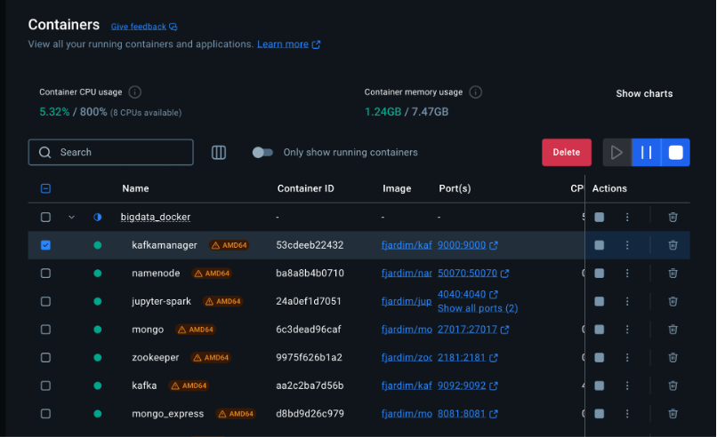

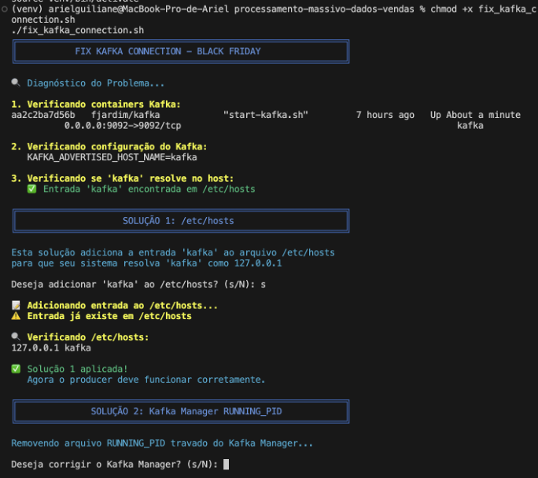

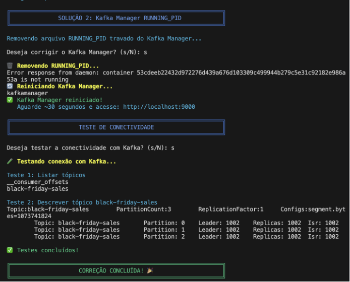

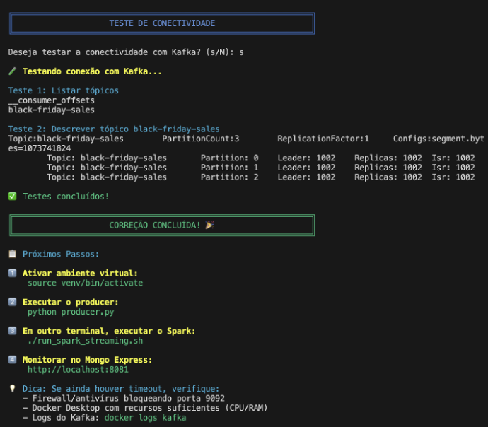

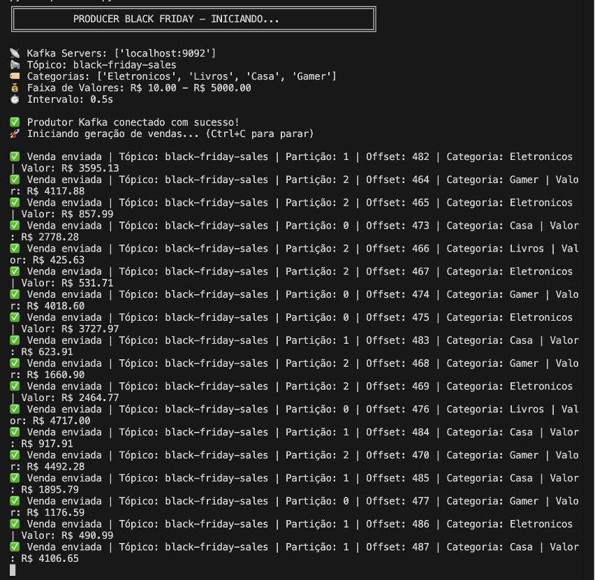


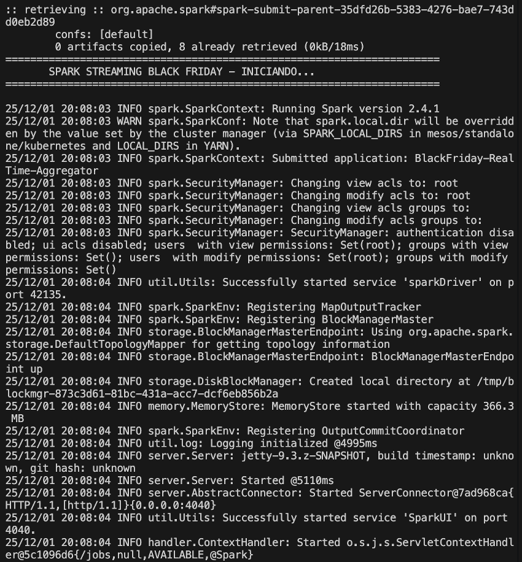

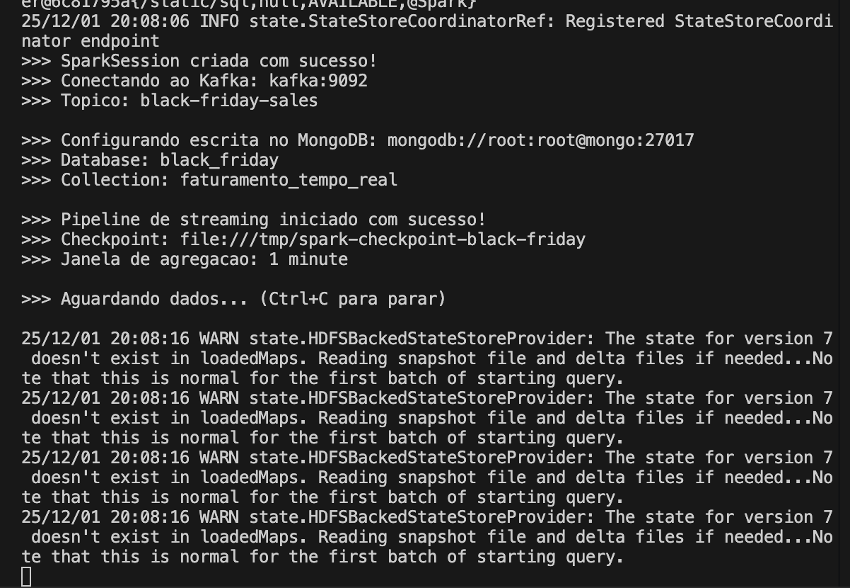

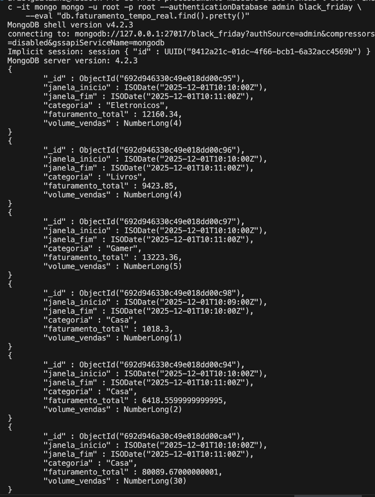

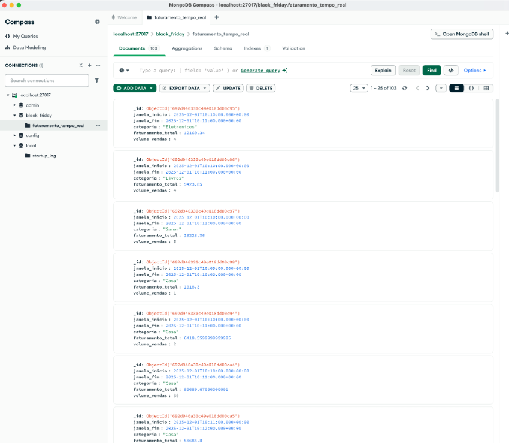

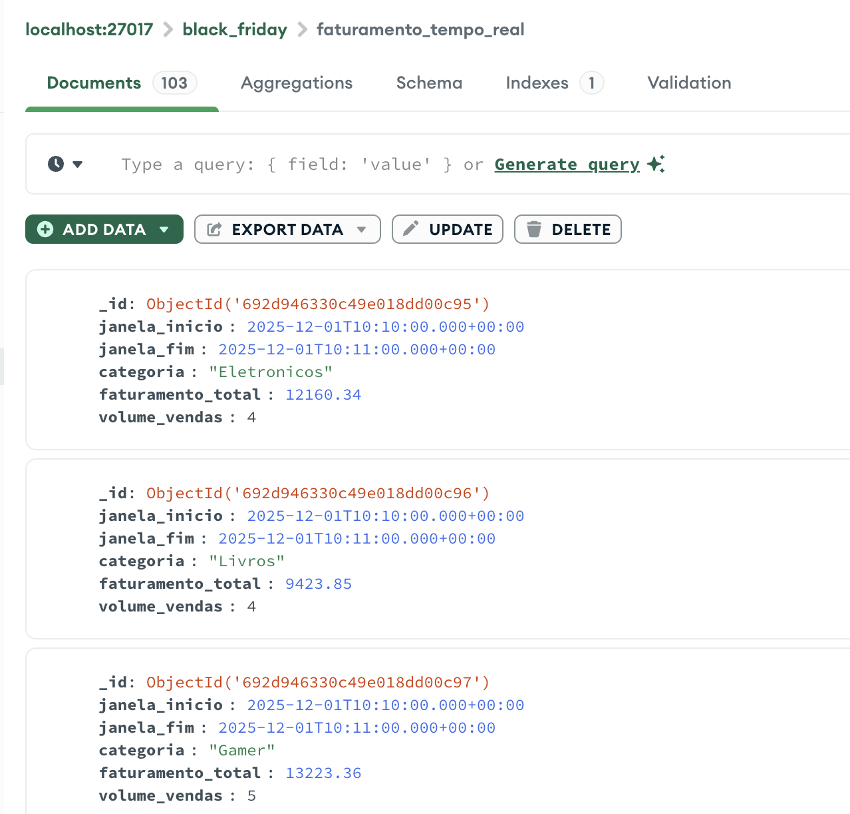

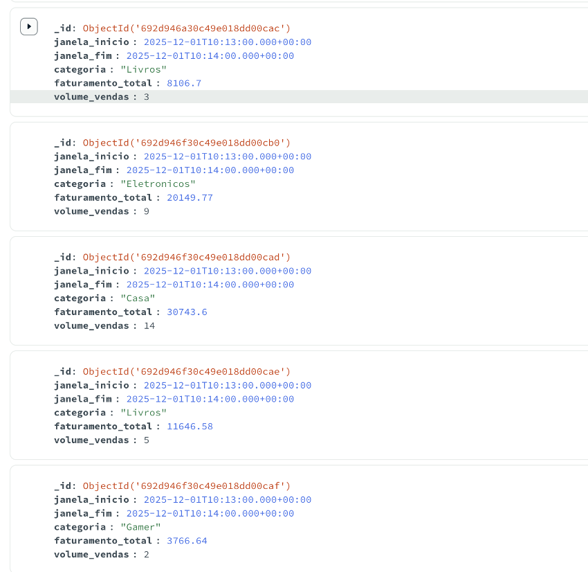

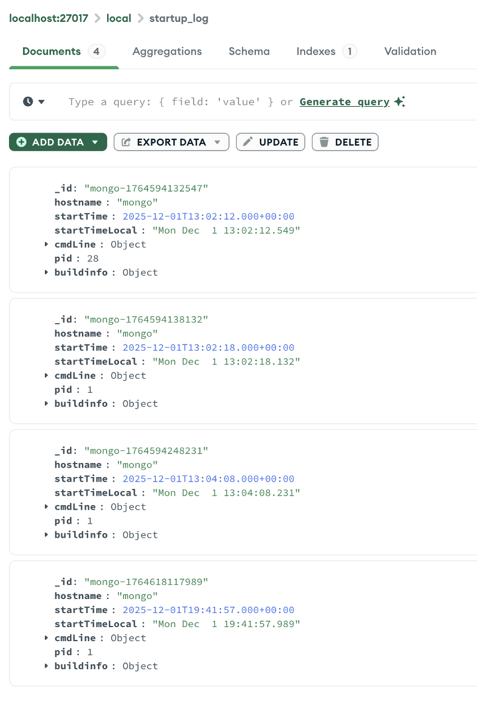

---

**Repositório Base Docker:** https://github.com/fabiogjardim/bigdata_docker

